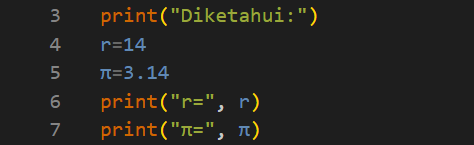
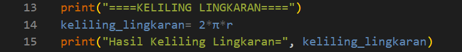
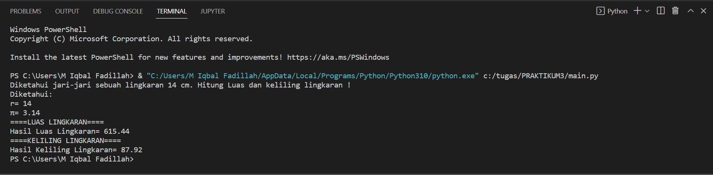
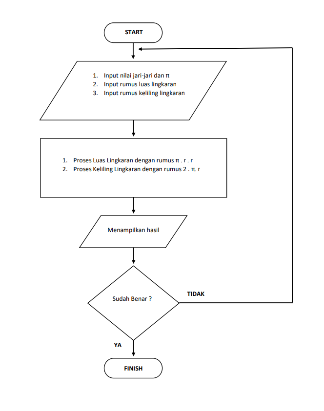

# PRAKTIKUM3

# Nama : Muhammad Iqbal Fadillah

# Kelas : TI.22 B.2

# NIM : 312210586

# Mata Kuliah = Bahasa Pemrograman

# SOAL

# MASUKKAN NILAI JARI-JARI DAN RUMUS

# HITUNG LUAS LINGKARAN

# HITUNG KELILING LINGKARAN

# HASIL MENGHITUNG LUAS DAN KELILING LINGKARAN

# FLOWCHART
